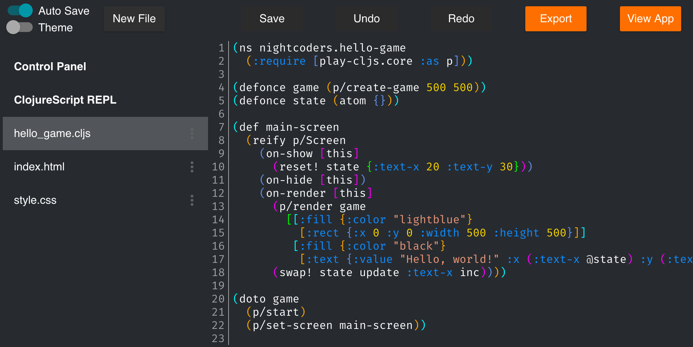

## Introduction

Nightcoders.net is a cloud IDE for ClojureScript. Do `boot run` for development and `boot build` to make a jar file. You will need JDK 8 or above installed along with the [Boot](http://boot-clj.com/) build tool.

To successfully run it on a server, all you need to do is run that jar file and make sure the `boot.jar` (located at the root of this repo) is in the same directory. It will need JRE 8 or above installed but will not need Boot installed.

That's not a joke...there is literally nothing else you need to do. Just `java -jar nightcoders.jar` and it will run. It uses H2, an embedded database, so there is nothing else to set up. Clojure is dope!

If you want to use your own Google Sign In client id (which you should...), find the existing one in these three files and change them to whatever you want:

* `resources/public/nightcoders.html`
* `resources/public/loading.html`
* `src/clj/nightcoders/core.clj`

## Licensing

All files that originate from this project are dedicated to the public domain. I would love pull requests, and will assume that they are also dedicated to the public domain.
